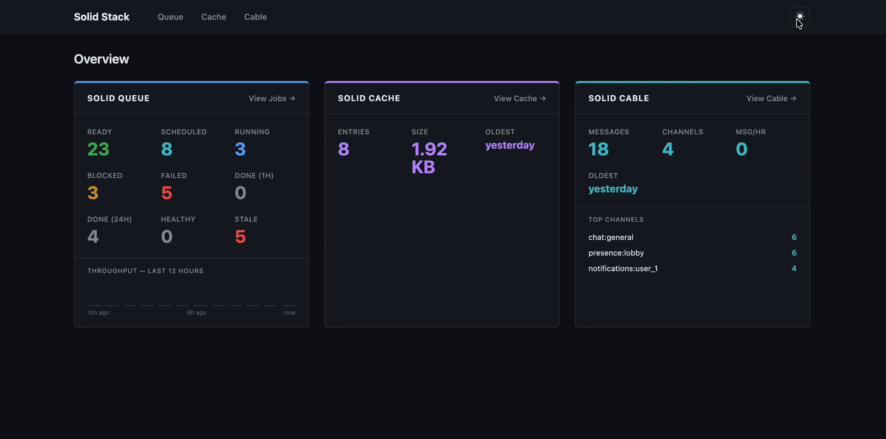

# SolidStackWeb

[](https://github.com/eclectic-coding/solid_stack_web/actions/workflows/ci.yml)
[](https://badge.fury.io/rb/solid_stack_web)
[](https://www.ruby-lang.org)
[](https://codecov.io/gh/eclectic-coding/solid_stack_web)

A production-ready operations dashboard for the full Rails Solid Stack. Mount one engine to get deep visibility into **Solid Queue** (job browser, failed job retry, queue controls, recurring tasks, performance stats), **Solid Cache** (entry browser, size distribution, write timeline), and **Solid Cable** (channel browser, message list, purge controls) — with dark mode, CSV export, alert webhooks, and a JSON metrics endpoint, all with no asset pipeline dependency.

## Installation

Add the gem to your application's `Gemfile`:

```ruby
gem "solid_stack_web"
```

Run:

```bash
bundle install
```

Run the install generator to create a documented initializer and wire up the mount point in one step:

```bash
rails generate solid_stack_web:install
```

This creates `config/initializers/solid_stack_web.rb` with every configuration option commented inline, and injects `mount SolidStackWeb::Engine, at: "/solid_stack"` into `config/routes.rb`. The dashboard will then be available at `/solid_stack` (or whatever path you choose).

---

## Screenshots



---

## Metrics endpoint

`GET /metrics` (relative to your mount path) returns a JSON payload suitable for external monitoring tools, uptime checkers, or custom alerting:

```json
{
  "queue": {
    "ready": 4,
    "scheduled": 1,
    "claimed": 2,
    "blocked": 0,
    "failed": 3,
    "done_1h": 45,
    "done_24h": 312,
    "processes_healthy": 2,
    "processes_stale": 0,
    "slow_jobs": 7
  },
  "cache": { "entries": 1024, "byte_size": 2097152, "oldest_entry": "2026-05-20T10:00:00Z" },
  "cable": { "messages": 50, "channels": 3, "messages_per_hour": 12, "oldest_message": "2026-05-20T10:00:00Z", "top_channels": { "ActionCable::Channel::Base": 30, "ChatChannel": 15, "NotificationsChannel": 5 } },
  "generated_at": "2026-05-26T10:00:00Z"
}
```

`slow_jobs` is only present when `slow_job_threshold` is configured. The endpoint is protected by the same authentication as the rest of the dashboard.

---

## General configuration

The install generator creates `config/initializers/solid_stack_web.rb` with all options documented inline. The available options are:

```ruby
SolidStackWeb.configure do |config|
  # Number of items per paginated page (default: 25)
  config.page_size = 50

  # Authentication — block runs in controller context.
  # Return a truthy value to allow access; falsy falls back to HTTP Basic.
  config.authenticate do
    current_user&.admin?
  end

  # Multi-database — pass a connects_to hash when Solid Queue / Cache / Cable
  # live on a separate database from your primary (default: nil, uses primary).
  config.connects_to = { database: { writing: :queue, reading: :queue } }
end
```

### Authentication

The `authenticate` block is evaluated in the context of each request's controller instance, so any helper method available to controllers (e.g. `current_user` from Devise) works directly. If the block returns `false` or `nil`, the engine falls back to HTTP Basic authentication. If no `authenticate` block is configured, the dashboard is open.

### Linking to the dashboard

`SolidStackWeb.mount_path` returns the path at which the engine is mounted, derived automatically from your routes. Use it to link to the dashboard from your application layout without hardcoding the path:

```ruby
link_to "Queue Dashboard", SolidStackWeb.mount_path
```

---

## Security

### Authentication

**The dashboard is open to all visitors by default.** Any production deployment must configure an `authenticate` block or the dashboard will be publicly accessible.

```ruby
SolidStackWeb.configure do |config|
  # Devise
  config.authenticate { current_user&.admin? }

  # HTTP Basic fallback (used when no authenticate block is set, or when
  # the block returns false/nil and you want a browser credential prompt)
  # Configure via HTTP_BASIC_AUTH_NAME / HTTP_BASIC_AUTH_PASSWORD env vars
  # in your host app, or use a reverse proxy.
end
```

If the `authenticate` block returns `false` or `nil`, the engine falls back to HTTP Basic authentication. If no block is configured at all, the dashboard is open.

### Sensitive cache values

`allow_value_preview` is `false` by default. Enabling it renders the raw serialised cache value on the entry detail page. Do not enable this if your cache stores session tokens, PII, or other sensitive data.

### CSRF protection

All state-mutating actions (job discard, retry, queue pause/resume, cache flush) use form POST requests. Turbo handles CSRF tokens automatically for any standard Rails app with `protect_from_forgery`.

### Rate limiting and network exposure

The dashboard is designed to be mounted behind your application's existing authentication. For additional hardening, consider:

- Mounting at a non-guessable path (e.g. `at: "/ops/#{Rails.application.credentials.dashboard_token}"`)
- Restricting access by IP at the reverse-proxy level
- Applying [Rack::Attack](https://github.com/rack/rack-attack) rules to the mount path

---

## Solid Queue

### Features

- **Overview dashboard** — live counts across all queue statuses; done (1h/24h), healthy/stale process counts, and optionally slow jobs (when `slow_job_threshold` is configured); 12-hour throughput sparkline and a 12-hour failures sparkline (red bars) with per-bar hover tooltips — failure spikes visible before clicking into the failed jobs list
- **Job browser** — browse jobs by status (ready, scheduled, claimed, blocked) with filtering by job class, queue name, priority, and time period; sortable by class, queue, priority, and enqueued-at; sort state is preserved across filter and period changes; **Discard All** bulk-discards every job matching the current filters in one request; **CSV export** downloads jobs respecting active filters
- **Bulk selection** — checkbox-select individual jobs for discard; select-all support
- **Per-queue browser** — click any queue name or size to drill into its ready jobs with per-row and bulk discard; pause/resume controls on the queue page
- **Queue depth sparklines** — Queues index shows a 12-hour depth chart per queue; each bar is the ready-job count at an hourly snapshot with an instant hover tooltip
- **Job detail page** — full arguments (pretty-printed JSON), queue, priority, enqueued time, Active Job ID, concurrency key, scheduled/blocked-until metadata, and a Discard button
- **Failed jobs** — list with retry / discard / bulk retry / bulk discard; sortable by class, queue, and failed-at; **Failed job detail page** — full error, backtrace, and an inline JSON argument editor; submit to update arguments and retry in one action
- **Error frequency report** — `GET /failed_jobs/errors` groups all failed jobs by exception class and message prefix with a count and expandable sample backtrace; links through to a filtered list for each error group
- **Scheduled job management** — "Run Now" and offset buttons (+1h / +24h / +7d) per row update the scheduled time inline via Turbo Stream; "Run All Now (N)" back-dates all matching executions at once
- **Recurring task list** — enumerates all `SolidQueue::RecurringTask` records with cron schedule, job class or command, queue, next-run and last-run times, and a static/dynamic badge; each row has a "Run Now" button
- **Performance statistics page** — `GET /stats` aggregates finished jobs by class name with execution count, avg, p50, p95, p99, std dev, min, and max duration; click any column header to sort; defaults to p95 descending; high std dev flags inconsistent jobs worth investigating
- **Job history view** — paginated list of all finished jobs with class name, queue, duration, and finished-at time; filterable by queue (click a badge), class substring, and time period; sortable by class, queue, and finished-at; CSV export respects active filters
- **Auto-refresh** — dashboard, jobs, processes, and history views poll automatically; pauses when the tab is hidden or a checkbox is checked; intervals configurable via `dashboard_refresh_interval` and `default_refresh_interval`
- **Turbo Stream** job discard — removes the row inline without a full page reload
- **Sticky filter preferences** — last-used status, period, and queue filter saved to `localStorage`; a fresh visit to the jobs or history list with no URL params automatically restores the previous selection
- **Dark mode** — toggle button in the header switches between light and dark palettes; preference persisted in `localStorage`; respects `prefers-color-scheme` on first visit
- **Responsive layout** — stats cards, tables, and two-column grids adapt to narrow viewports; tables scroll horizontally rather than overflow; split page headers stack on small screens
- **Empty-state improvements** — all list views show a contextual title and an actionable hint; search empty states include a "Clear search" link; filters-active history view offers "Clear filters"; processes and recurring tasks explain the next step
- **Inline notifications** — bulk and single-job actions surface a flash notice; Turbo Stream discard responses inject the message inline without a full page reload; bulk actions report the affected count ("3 jobs discarded")

### Configuration

```ruby
SolidStackWeb.configure do |config|
  # Slow job threshold in seconds (default: nil — stat hidden).
  # When set, the dashboard shows a "Slow (24h)" count of finished jobs
  # whose wall time exceeded this value. Links to the Stats page.
  config.slow_job_threshold = 30

  # Alert webhooks — fired on every GET /metrics poll when a threshold is met.
  # Delivery failures are silently swallowed; cooldown prevents alert storms.
  config.alert_webhook_url       = "https://hooks.example.com/my-alert"
  config.alert_failure_threshold = 10          # POST when failed jobs >= this
  config.alert_queue_thresholds  = {           # POST when a queue's ready depth >= value
    "critical" => 50,
    "default"  => 500
  }
  config.alert_webhook_cooldown  = 3600        # seconds between alerts (default: 3600)

  # Auto-refresh intervals in milliseconds.
  config.dashboard_refresh_interval = 5_000   # overview dashboard (default: 5000)
  config.default_refresh_interval   = 10_000  # jobs, processes, history (default: 10000)

  # Maximum results shown by the search feature (default: 25).
  config.search_results_limit = 25

  # Show the raw serialized value on the cache entry detail page (default: false).
  # Disable for stores that contain sensitive data.
  config.allow_value_preview = true
end
```

#### Job Filtering

The jobs list supports four independent filters, all driven by query params:

| Param | Description |
|-------|-------------|
| `q` | Substring match against the job class name (e.g. `q=Report`) |
| `queue` | Exact queue name match; select appears only when multiple queues exist |
| `priority` | Exact priority value match; select appears only when multiple priorities exist |
| `period` | Enqueued-at window — `1h`, `24h`, `7d`, or omit for all time |

Filters are preserved when switching between status tabs (Ready / Scheduled / Running / Blocked) and when discarding a job. They can be combined freely.

---

## Solid Cache

### Features

- **Overview dashboard card** — live entry count (linked to the entry browser), total byte size, and oldest-entry age (`time_ago_in_words` with exact timestamp on hover; hidden when cache is empty)
- **Cache timeline** — two side-by-side 24-hour bar charts showing entries written per hour and bytes written per hour; each bar has a hover tooltip
- **Size distribution** — byte-range histogram (< 1 KB → > 1 MB) with entry counts and proportional inline bars; hidden when cache is empty
- **Largest entries** — top 10 entries by byte size, each linked to the detail page; hidden when cache is empty
- **Entry browser** — `GET /cache/entries` lists all `SolidCache::Entry` records in a paginated, sortable table; columns: key, byte size, created-at; sortable by any column; key auto-submits search after 4 characters
- **Key search** — filter entries by key substring; results update automatically after 4 characters
- **Entry detail page** — `GET /cache/entries/:id` shows the full key, byte size, and created-at; optionally displays the raw serialized value (see `allow_value_preview` below)
- **Delete entry** — per-row delete button or detail-page button removes a single cache entry
- **Flush All** — header button deletes every cache entry with a confirmation prompt

---

## Solid Cable

### Features

- **Dashboard card** — the overview dashboard shows total messages, channels, messages per hour (last 60 minutes), oldest pending message age, and a top-3 channel breakdown by volume
- **24-hour timeline** — bar chart of message volume on the Cable overview page; each bar represents one hour with a hover tooltip showing the exact count
- **Channel browser** — `GET /cable` lists all active channels with per-channel message count and last-message timestamp, ordered by most recent activity; supports `?q=` filtering by channel name substring; empty state shown when no messages exist
- **Per-channel message list** — `GET /cable/channels/:channel_hash` shows a paginated, reverse-chronological list of that channel's `SolidCable::Message` records; each row shows the message ID, a truncated payload preview (120 chars) with the full payload on hover, and a relative sent time with the exact timestamp on hover; supports `?q=` filtering by payload substring; **Purge Channel** button deletes all messages for the channel
- **Message purge** — "Purge Old" form on the channel browser deletes all messages older than 1, 7, or 30 days; confirmation prompt before any destructive action

---

## Requirements

- Ruby >= 3.3
- Rails >= 8.1.3
- [solid_queue](https://github.com/rails/solid_queue) >= 1.0
- [solid_cache](https://github.com/rails/solid_cache) >= 1.0
- [solid_cable](https://github.com/rails/solid_cable) >= 1.0
- [turbo-rails](https://github.com/hotwired/turbo-rails) >= 2.0
- [importmap-rails](https://github.com/rails/importmap-rails) >= 1.2

## Versioning

SolidStackWeb follows [Semantic Versioning](https://semver.org/spec/v2.0.0.html).

### Public API

The following are considered stable public API from v1.0.0 onwards — breaking changes to any of these require a major version bump:

- The `SolidStackWeb.configure` block and all documented configuration keys
- The `SolidStackWeb.mount_path` helper
- The `authenticate` block interface
- The `GET /metrics` JSON payload shape
- The `SolidStackWeb::Engine` class and its mount interface
- The `rails generate solid_stack_web:install` generator

### Not part of the public API

The following are internal and may change in any release without notice:

- Internal service classes (`CacheStats`, `QueueStats`, etc.)
- View templates, partial names, and CSS class names
- Controller and helper internals
- Private methods on any class

### Deprecation policy

When a public API item is renamed or removed, the old interface is deprecated in a **minor** release — it continues to work but issues an `ActiveSupport::Deprecation` warning pointing to the replacement. The old interface is removed in the next **major** release. The [UPGRADING.md](UPGRADING.md) file documents every breaking change and the migration steps.

---

## Contributing

1. Fork the repository
2. Create a feature branch (`git checkout -b feat/my-feature`)
3. Run the test suite: `bundle exec rake`
4. Open a pull request

Bug reports and feature requests are welcome on [GitHub Issues](https://github.com/eclectic-coding/solid_stack_web/issues).

## License

The gem is available as open source under the terms of the [MIT License](https://opensource.org/licenses/MIT).